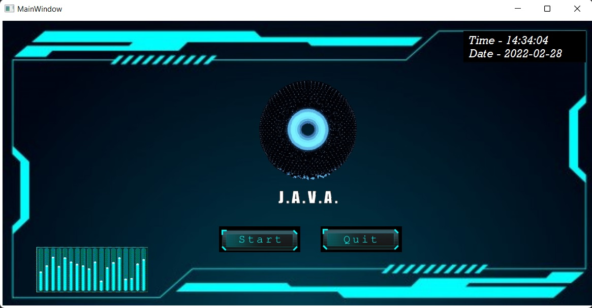

# J.A.V.A.
### This is an AI/ML based voice assistant which can play songs on youtube, send emails and many more amazing task just by your voice command    

Working UI
-------
  

## Featues:-
#### - This uses face recognition to identify the users
#### - The voice assistant can take commands in two languages (English/Hindi)

## Future Vision:-
#### - To give roles to the user after face recognition
#### - To take multiple commands using multi-threading

## Libraries used:-
pyttsx3
speech_recognition
PyQt5
face_recognition
OpenCV
